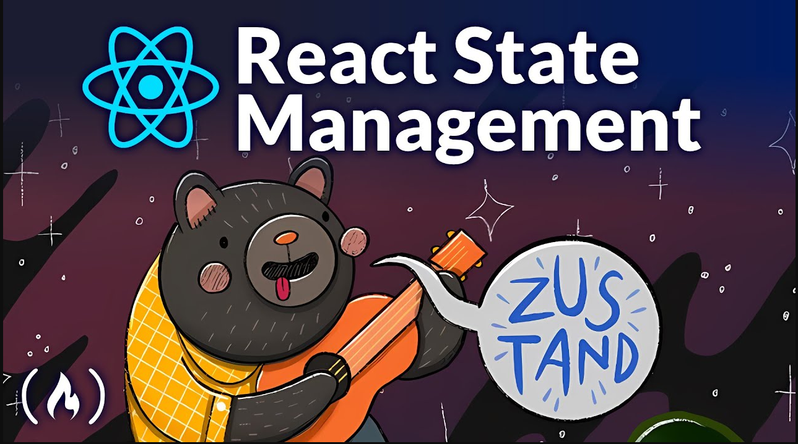

# Zustand React State Management Course (Simple Redux Alternative)

https://www.youtube.com/watch?v=fZPgBnL2x-Q&ab_channel=freeCodeCamp.org

Learn Zustand in this full course for beginners. Zustand is a minimalistic state management library for React, offering a simpler API compared to Redux. It aims to provide ease-of-use without sacrificing flexibility and performance in modern web applications. It provides a simple and intuitive API for managing and updating application state without the need for boilerplate code or complex patterns.

**Project** --> Kanban Board using react and zustand 
**Channel** --> freeCodeCamp.org 8,55 mi de inscritos 
**Date Created** --> 25 de abr. de 2023

### npm Commands

npm create vite . 
npm i zustand  
npm i classnames  

-  className={classNames("column", { drop: drop })}
-  
{task.state}

   npm i --save-dev vitest @testing-library/jest-dom @testing-library/react jsdom 
   npm i immer 
-  state manipulation a bit differently
-  tasksInOngoing: 0, addTask: async (title, state) => set(produce((store) => { store.tasks.push({ title, state }) }), false, "addTask")

### Components

-  main
-  App
-  Comlumn
-  Task
-  store(zustand)

### Observations/Notes

-  A small, fast and scalable bearbones state-management solution using simplified flux principles. Has a comfy API based on hooks, isn't boilerplatey or opinionated. 
-  Don't disregard it because it's cute. It has quite the claws, lots of time was spent dealing with common pitfalls, like the dreaded [zombie child problem](https://react-redux.js.org/api/hooks#stale-props-and-zombie-children), [react concurrency](https://github.com/bvaughn/rfcs/blob/useMutableSource/text/0000-use-mutable-source.md), and [context loss](https://github.com/facebook/react/issues/13332) between mixed renderers. It may be the one state-manager in the React space that gets all of these right.

### [Why zustand over redux?](https://github.com/pmndrs/zustand#why-zustand-over-redux)

-  Simple and un-opinionated
-  Makes hooks the primary means of consuming state
-  Doesn't wrap your app in context providers

### [Why zustand over context?](https://github.com/pmndrs/zustand#why-zustand-over-context)

-  Less boilerplate
-  Renders components only on changes
-  Centralized, action-based state management

⭐️ **Contents** ⭐️ 
0:00:00 Why Zustand? 
0:07:28 Setting Up Our Project 
0:09:45 Creating The Basic Components 
0:17:48 Storing Tasks 
0:19:50 Disclaimer About Object State 
0:23:39 Displaying Tasks 
0:25:48 Adding Tasks 
0:34:55 Deleting Tasks 
0:37:57 Moving Tasks 
0:45:34 Using Zustand Middleware 
0:52:08 Unit Testing Zustand Stores 
1:08:27 Advanced Zustand Features 
1:14:17 Outro
